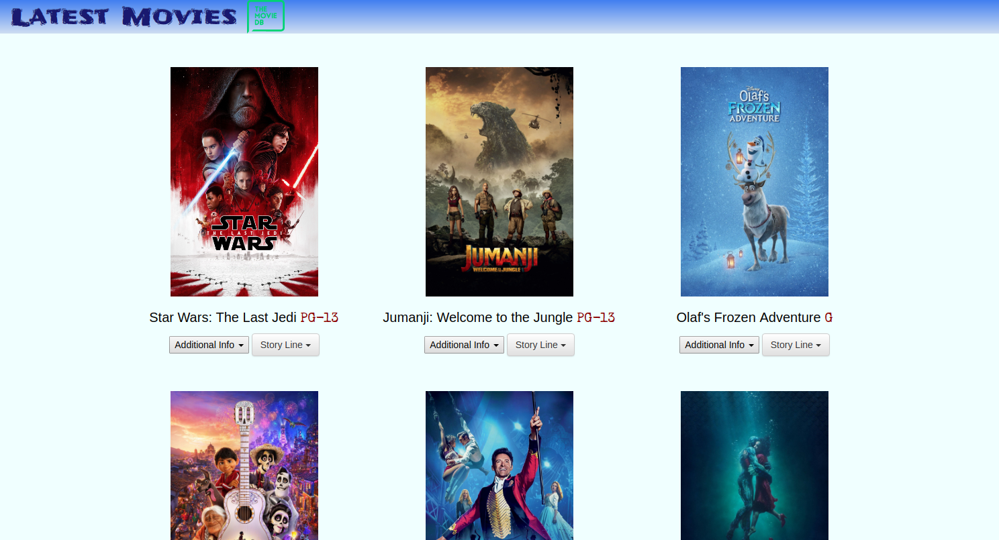

# Project: Movie Trailer Website

For this project I wrote code that uses an API from *themoviedb*. I used a get call to retreive the title, poster image, youtube trailer, as well as other information about each movie. I used two python classes to store information about each movie. When you open *fresh_tomatoes.html* file you will see a list of movies available in threater. 

	
**Install Prerequisites**

1. Python 2.7
2. tmdbsimple -- Install by using pip, the command is pip install tmdbsimple

**Resources Used** 

1. themoviedb.org - a key is required to access their API (https://developers.themoviedb.org/3/)
2. tmdbsimple - is the API used to access themoviedb.org (https://github.com/celiao/tmdbsimple)

**Running Code**

In order to run the code you have to open up IDLE (Python) shell. Click on file open... and then navigate to the directory where fresh_tomatoes.py, media.py, and entertainment_center.py files are located. Once there, open up the file entitled entertainment_center.py. Within the entertainment_center.py file in the interpretor click on RUN and then RUN MODULE. An html file should be generated within your folder and your browser will automatically load that html file for your viewing.

**Other**
Takes about 19.1 seconds to run. 

